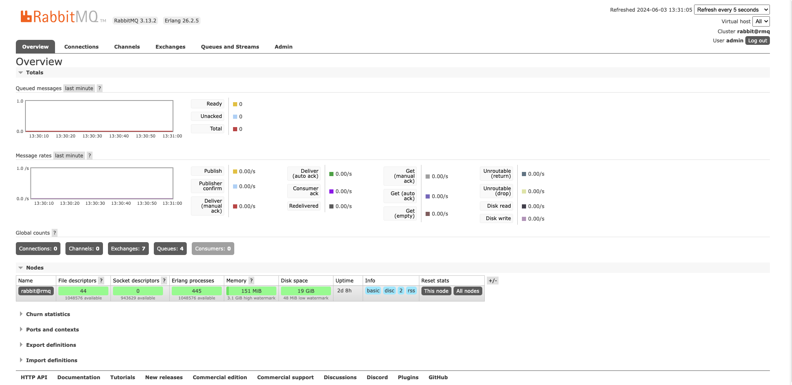

# noderabbitmq
Mircoservices using rabbit mq or message queue implementation

Both application are accessible at 
http://localhost:3301 (mainapp)
http://localhost:3300 (backend)

Mainapp  Message consummer

Backend Message Emitter

Rabbit MQ docker can be run through follow command

docker run -d --hostname rmq --name rabbit-server -p 8888:15672 -p 5672:5672 rabbitmq:3-management

Rabbit mq interface accessible as under 

Different tabs to navigate to channels queues and other stuff. 